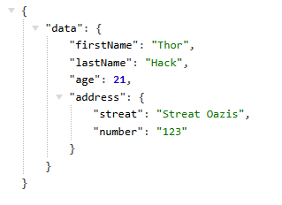

# Merge Array Into Object (MAIO)

A package to merge arrays into objects in PHP.

## Installation

```bash
composer require isq/maio
```

## Basic Usage

```php
use MAIO\MergeArrayIntoObject;

class CreateUserDTO {
    public string $firstName;
    public string $lastName;
    public string $email;
    public int $age;
}

$data = [
    'firstName' => 'John',
    'lastName' => 'Doe',
    'email' => 'john.doe@example.com',
    'age' => 30,
];

$dto = new MergeArrayIntoObject()->merge(new CreateUserDTO, $data);

print_r($dto);

// Output:
// CreateUserDTO Object
// (
//     [firstName] => John
//     [lastName] => Doe
//     [email] => john.doe@example.com
//     [age] => 30
// )

```

## Define Key to Merge

You can define the key to merge using the `Key` attribute.

```php
use MAIO\MergeArrayIntoObject;

class CreateUserDTO {
    #[Key('first_name')]
    public string $firstName;
    public string $lastName;
    public string $email;
    public int $age;
}

$data = [
    'first_name' => 'John',
    'lastName' => 'Doe',
    'email' => 'john.doe@example.com',
    'age' => 30,
];

$dto = new MergeArrayIntoObject()->merge(new CreateUserDTO, $data);

print_r($dto);

// Output:
// CreateUserDTO Object
// (
//     [firstName] => John
//     [lastName] => Doe
//     [email] => john.doe@example.com
//     [age] => 30
// )
```

## Define Static Method to Merge

You can call method static of the type defined in property with attribute `StaticCall`.

```php
use MAIO\MergeArrayIntoObject;

class UserModel {
    public static function find(int $id): UserModel
    {
        // Find user by id
    }
}

class CreateUserDTO {
    #[Key('user_id')]
    #[Call(UserModel::class, 'find')]
    public UserModel $user;
}


$data = [
    'user_id' => 1,
];

$dto = new MergeArrayIntoObject()->merge(new CreateUserDTO, $data);

print_r($dto);

// Output:
// CreateUserDTO Object
// (
//     [user] => UserModel Object
// )
```

## Real use Example with Laravel

```php
// routes/web.php

<?php

use Illuminate\Http\JsonResponse;
use Illuminate\Support\Facades\Route;
use MAIO\Attributes\Call;
use MAIO\Attributes\Key;
use MAIO\MergeArrayIntoObject;

class BaseDTO
{
    public static function make(array $data)
    {
        return (new MergeArrayIntoObject())->merge(new static(), $data);
    }
}

class UserDTO extends BaseDTO
{
    #[Key('first_name')]
    public string $firstName;

    #[Key('last_name')]
    public string $lastName;

    #[Key('age')]
    public int $age;

    #[Key('address_data'), Call(AddressDTO::class, 'make')]
    public AddressDTO $address;
}

class AddressDTO extends BaseDTO
{
    public string $streat;
    public string $number;
}

$simulateRequestData = [
    'first_name' => 'Thor',
    'last_name' => 'Hack',
    'age' => 21,
    'address_data' => [
        'streat' => 'Streat Oazis',
        'number' => 123
    ]
];

Route::get('/', function (): JsonResponse use($simulateRequestData) {
    $dto = UserDTO::make($simulateRequestData);

    $address = Address::create([
        'streat' => $dto->address->streat,
        'number' => $dto->address->number
    ]);

    $user = User::create([
        'first_name' => $dto->firstName,
        'last_name' => $dto->lastName,
        'age' => $dto->age,
        'address_id' => $address->id
    ]);

    return response()->json([
        'data' => UserResource::make($user)
    ]);
});
```

Output:


